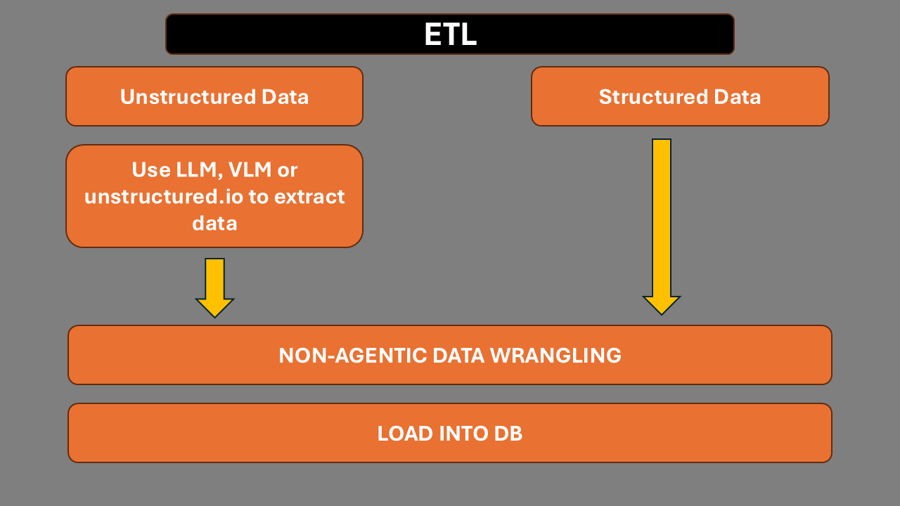
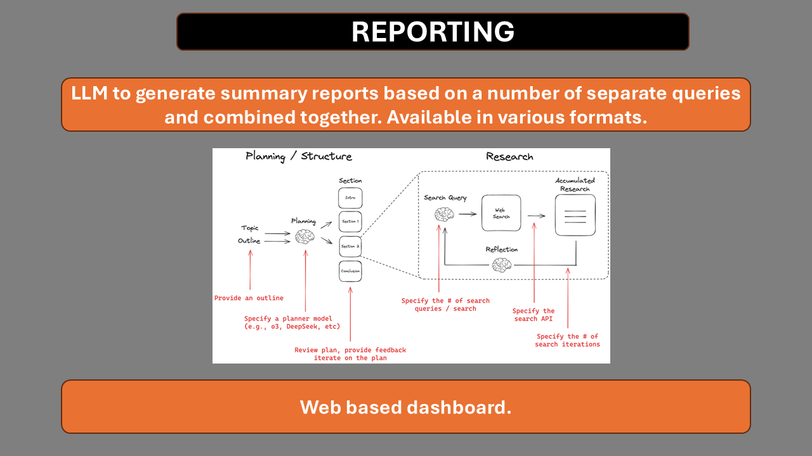
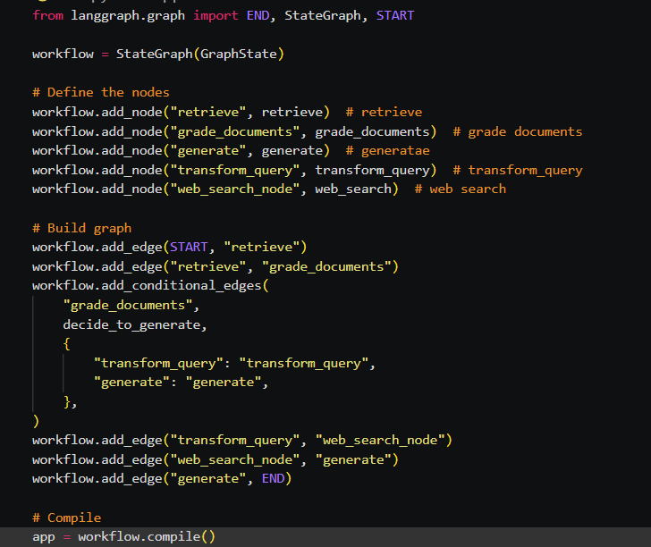

# AI Agents and Data

### Workshop ideas

The exact content and promo description will need to be determined by us to reflect realistically how the workshop will benefit attendees.

Over the next 6 months, there will be significant advances in LLM capabilities as well as dramatic cost reductions. 

The workshop will keep pace with these ideas and be very current with the latest trends.

"When can AI Agents help us in the Data Pipeline and Data Analysis rather than deterministic pipelines that we have already been using successfully for years?"

- R in Python https://pypi.org/project/rpy2/
- Data extraction with unstructured.io
- 2 types of attendees - developer and the data professional that will need to inform their company about AI Agents in the Data Pipeline.

### The workshop content:

- Simplification and demystification of AI Agents by building them from scratch using notebooks with embedded slides for any theory that comments don't cover.
- Examining where the use of AI Agents in the Data Pipeline from ETL, Analysis to Reporting can be of value.
- Looking at two approaches to SQL queries 1). AI Agents creating the SQL on the fly and 2). Using LLMs to select the most suitable SQL Query that has been developed and tested. For overall DB queries, 2 is favoured.
- Use of LLMs and Vision models to analyse tabular data and charts etc.
- Understanding the types of workkflows that can be used and Agentic RAG as well as Multi Agent patterns.
- How we can synthesise reports to summarise all separate results into one report.
- Once we understand the raw mechanics we can look at some frameworks available to see how they can assist us further if needed.
- Examining how we test and evaluate these AI Agents and workflows.
- Use of Prompting v RAG v Fine Tuning.

### Text2SQL

The core is Text2SQL - when a user asks a question about data, the AI Agent will generate a SQL Query that can be executed to answer the question, along with charts and reports as requested.

- Looking at two approaches to SQL queries 1). AI Agents creating the SQL on the fly and 2). Using LLMs to select the most suitable SQL Query that has been developed and tested. For overall DB queries, 2 is favoured.

The approach I favour (2), is fundamentally an AI Powered Search of the best 'product'. If we store an SQL query along with metadata, our task is to translate natural language into the best SQL Query that has been tried and tested. This would involve Hybrid Search - both keyword and semantic search.
  
### Product ideas

In developing this workshop, we are developing a product/service where enterprises can 'chat' to not just their data but also to documents and other data sources.

 

## Slides

### ETL

### Planning

### Agentic RAG

### Queries

### SQL as Doc

### Strategy

### Crowd Sourced Answers

It might transpire that have nested sub query docs for a given sql doc may be beneficial.

<!-- ### Agentic RAG

 -->

### Workflows

This is Langgraph buildt by Langchain and uses a Finite State Machine to define the workflow.

