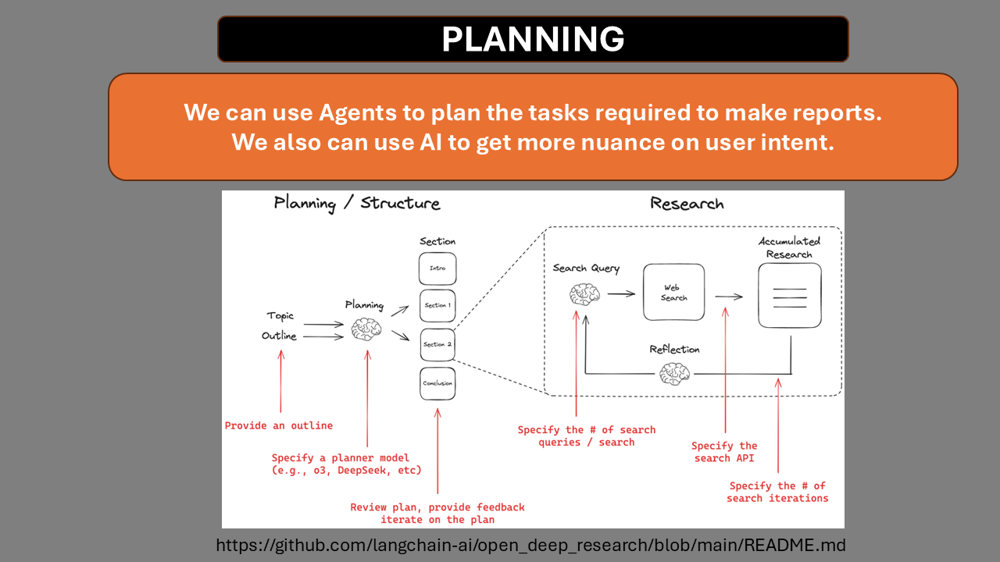
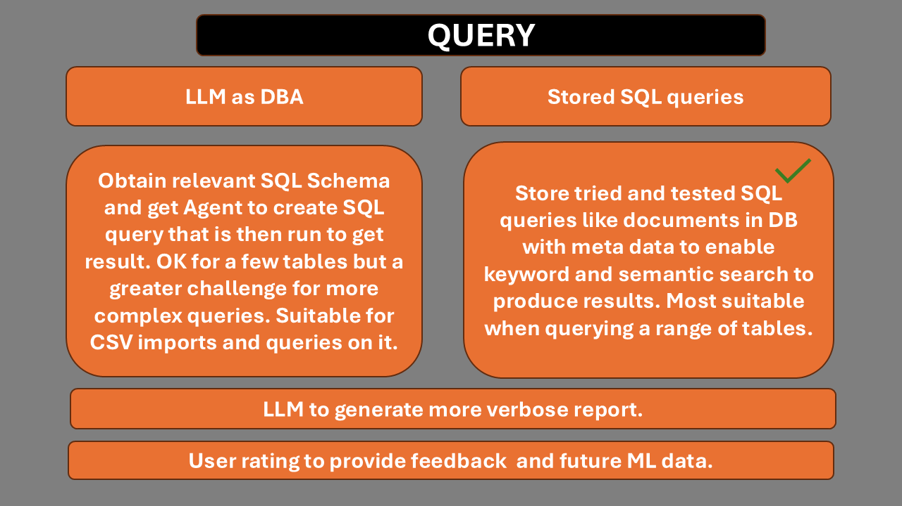

# AI Agents and Data

## Notes for meeting only...

- R in Python https://pypi.org/project/rpy2/
- Data extraction with unstructured.io
- 2 types of attendees
- New reasoning models for Pipelines 
- Prompt vs Rag vs Fine Tuning
- Understand AI Agents from scratch
- SQL generation - NOT LLM uses schema to create SQL but tried and tested SQL from RAG type query.
- Report selection router with RAG - hybrid to select best SQL query based on meta information
- Agentic Rag and LLM workflows
- Multi Agent systems and frameworks like ReportMaistro
- Using vision models for analysis and data extraction
- Infomercial

Where and how are AI Agents able to help us in the Data Pipeline from ETL, Analysis to Reporting?

We focus on 2 types of attendees:

1. The Developer/Data Scientist who wants to understand what and how AI Agents work, what they can offer in the data pipeline and shortcuts to libraries and frameworks that can get them an MVP up and running quickly.
2. The data professional who needs to understand how AI can help their organisation and will need to present information to other members of the organisation being the 'AI person'.

The non technical person who will want to get answers and reports from the data but who are not data scientists. They want the proverbial 'chat with data' experience.

### When and Why?

A question I ask myself is 'When and why will AI Agents be useful in the data pipeline?' compared to deterministic pipelines that we have already been using successfully for years?

Whilst AI can offer many helpful tools to the data scientist/developer as in coding assistants, I feel the most useful aspect is in the 'chat with data' sphere, enabling managers to get insights and reports from the data by asking questions in a way they might ask the data scientist - natural language.

Adding 'a bit of Agentic AI' may also be valuable to an organisation that feels a certain pressure to have Agentic AI even if they don't really need it.

### Reasoning Models

Reasoning models differ from current models in that we give a goal, how we want the output and what we want to avoid, and the LLM figures it all out, displaying its thought process as part of the response.

They are slower, but speed is not a priority for accurate and qulity reports that can send a notification/email when completed. This type of work is not needed to be fast.

These are becoming more advanced and cheaper as time goes by.

For quick 'ChatGPT' type answers we can use less powerful models.

### Now vs Oct 2025

In the next 7 months to mid October, the AI landscape will have changed a great deal. 

- Large Language Models will be even more powerful and cost effective.
- AI Agents will have more robust and capable frameworks available.
- Multi modality will be more advanced.

### Features of Agentic AI

- Chat with data using Text2SQL and RAG techniques alongside well established and deterministic SQL reports already in the system.
- Generating reports with more Natural Language as the mortar around the data bricks.
- Workflow Automation to include aspects like Agents creating plans that specialist Agents then execute and report back to a supervising Agent.
- Vision models that can analyse images of charts etc.
- Extending data sources to include PDFs, images, videos, audio and other formats...'one Agent to rule them all'.

### Products and Services

In creating the workshop, if we take a real world case (no real data though), we can start to think about how AI Agents can help the organisation.

With this in mind, over the next 7 months once can create products/services that can be offered to businesses such as bespoke solutions, implementation and training on the systems.

The 3 hour workshop will cover the landscape and some implementations so that people have a solid grasp and understanding of AI Agents.

Many may need further assistance or development and D can then be in a postion to offer these. The workshop could be like the US 'Infomercial' that combines teaching value as well as product advertisement.

 
