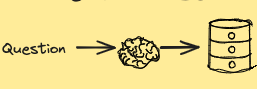
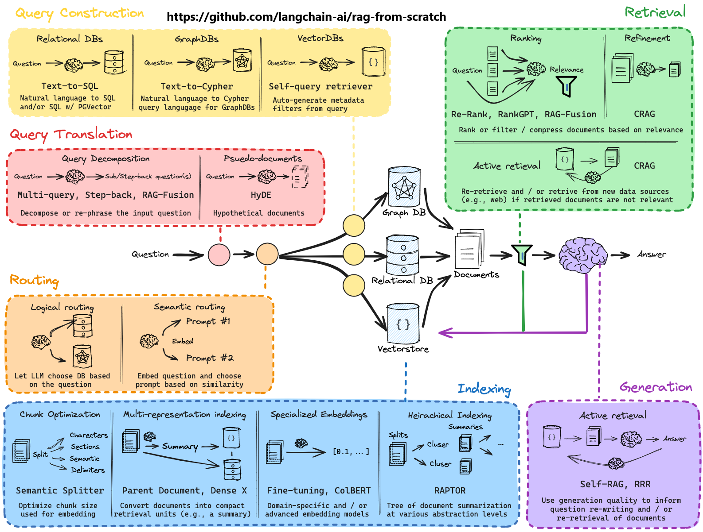

# AI Powered Knowledge Systems 

## Mission

To create a Software as a Service, (SASS), product that enable the medical community to harness the power of AI to improve extraction and presentation of relevent, accurate and complete information from the vast amount of data available in the medical literature.

## Current concepts

What are the current concepts/buzz words in this space?

### LLM

A large language model (LLM) is a type of artificial intelligence (AI) program that can recognize and generate text, among other tasks. LLMs are trained on huge sets of data — hence the name "large." LLMs are built on machine learning: specifically, a type of neural network called a transformer model.

We represent it in our architecture as a brain and this serves us well as we can also think what would a human do at this stage?

### Vector Databases

### Semantic search

### RAG

### Prompt Engineering

Create 'scene' for LLM...

### AI Agents

An artificial intelligence (AI) agent is a software program that can interact with its environment, collect data, and use the data to perform self-determined tasks to meet predetermined goals. Humans set goals, but an AI agent independently chooses the best actions it needs to perform to achieve those goals. For example, consider a contact center AI agent that wants to resolves customer queries. The agent will automatically ask the customer different questions, look up information in internal documents, and respond with a solution. Based on the customer responses, it determines if it can resolve the query itself or pass it on to a human.

Whilst we may have our overall flowchart, the AI Agent will determine the path to take. It is like having the roll of a dice determine the next step. We have a predetermined set of tasks, but the agent will determine the best way to complete those tasks.

## Naive Rag

Two years ago when we first looked at RAG, the strategy was to take a document and split into chuncks of say 500 characters and have an overlap of 100 charactes with the next chunk to maintain some context.

This works very well for single modality text documents where this Niave Rag is in effect a search tool, taking an unstructured query and using LLMs and semantic search to find relevant chunks and answer the question.

## Changes in 2yrs

In the past two years there have been many changes in the space.

- Context windows, the amount of text we can pass to the LLM has grown from 4K to 32K+
- Compute power has greatly increased, costs have gone donw by 90%.
- LLMs have become bigger and better, with many specialist LLMs that are fine tuned for particular uses.
- LLMs can now understand images, tables and videos better, with LLMs that can parse different media and convert them into text.
- Many frameworks and services for RAG have emerged and 2025 is thought of the year that the question will be which system to use?
- Naive Rag has been replaced with more sophisticated strategies that involve all aspects of the architecture:

Without needing to understand this next image, here is the current 'state of the art' RAG architecture:

New academic papers for better techniques are continually being published.

*"This is the worst it will ever be..."* - someone said.

 