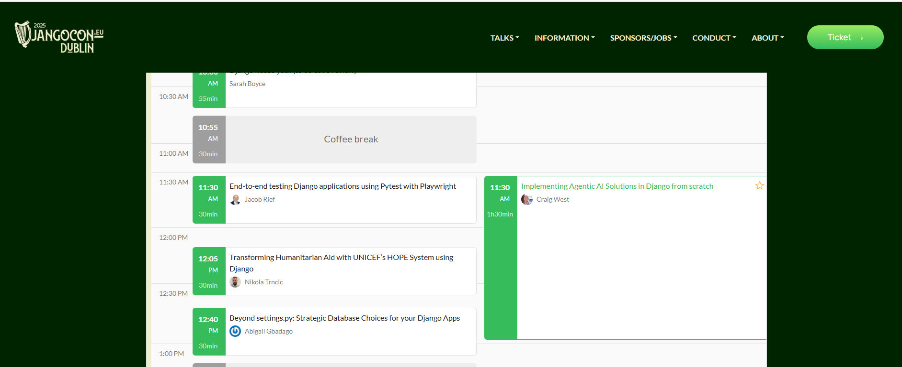

# Talks and Workshops 
- BrightonPy Feb 2025: AI as API in everyday Python apps - 60 minute talk and demo.

- Django Japan Congress Feb 2025 (online): Implementing Agentic AI solutions in Django from scrathc - 45 minute talk

- Conf42 (online) Feb 2025: Implementing Agentic AI Solutions in Python from scratch - 50 minute talk.

- PyCon Ireland Nov 2024: Getting started with Pytest - 2 hr workshop.

Next...

- DjangoConEurope April 2025: Implementing Agentic AI solutions in Django from scratch - 90 minute workshop.

